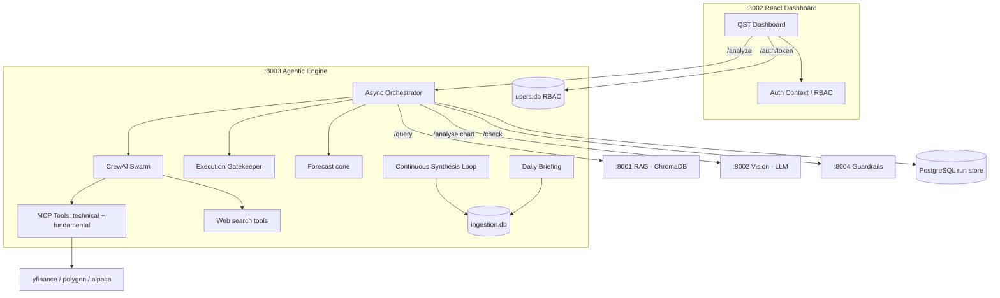

# 🏛️ QST · Quant Swarm Terminal — Full System Research

> **QST (Quant Swarm Terminal)** is an autonomous, multi-agent quantitative
> research desk. A swarm of specialist AI agents fuses live market data
> (via the **Model Context Protocol**), chart **vision**, retrieval-augmented
> context, and macro/fear signals into structured, probabilistic trade reports —
> behind a role-based, terminal-aesthetic dashboard.

---

## Table of Contents

1. [Overview](#1-overview)
2. [System Architecture](#2-system-architecture)
3. [Component Diagram](#3-component-diagram)
4. [Layer 1 — Frontend](#4-layer-1--frontend)
5. [Layer 2 — Orchestration](#5-layer-2--orchestration)
6. [Layer 3 — Microservices](#6-layer-3--microservices)
7. [Layer 4 — LLM Router](#7-layer-4--llm-router)
8. [MCP — Model Context Protocol](#8-mcp--model-context-protocol)
9. [End-to-End Data Flow](#9-end-to-end-data-flow)
10. [Authentication & RBAC](#10-authentication--rbac)
11. [Infrastructure & DevOps](#11-infrastructure--devops)
12. [Observability Stack](#12-observability-stack)
13. [Security & Execution Gatekeeper](#13-security--execution-gatekeeper)
14. [Use Cases](#14-use-cases)
15. [Glossary](#15-glossary)

---

## 1. Overview

### What does the system do?

QST turns open-ended market questions into **structured probability reports**.
A user (or a schedule) asks about an instrument; a crew of specialist agents
gathers evidence from multiple sources, debates it, and a Quant Execution
Manager synthesises a single JSON report containing directional probabilities,
a technical view, a fundamental view, a risk assessment, an (optional) execution
plan, and a forecast cone.

The desk operates in three complementary modes, each with a clearly labelled
data-provenance chip in the UI:

| Mode | Purpose | Pipeline behind it | Provenance chip |
|------|---------|--------------------|-----------------|
| **Live Desk** | Always-on monitoring of all 10 tickers | Continuous synthesis loop reading the 1-min ingestion cache (cheap, budget-safe) | `CONTINUOUS · CACHED` |
| **Analysis** | On-demand single-ticker deep-dive | Live engine: MCP market data + chart vision + full 7-agent crew | `LIVE · MCP + VISION` |
| **Briefing** | Scheduled pre-market summary | Offline crew + lognormal GBM move-probabilities + crew bias | `MORNING · GBM MODEL` |

### Active Watchlist (V2.0)

A strict, single-source-of-truth whitelist of **10** instruments
(`app/watchlist.py`). Off-list tickers are rejected with HTTP 422 before any
work begins.

| Ticker | Instrument | Class |
|--------|-----------|-------|
| SPCX | Space Exploration Technologies | Equity (newly public) |
| MSFT | Microsoft | Equity |
| AAPL | Apple | Equity |
| NVDA | NVIDIA | Equity |
| GOOGL | Alphabet | Equity |
| AMZN | Amazon | Equity |
| UPRO | ProShares UltraPro S&P 500 (3×) | Leveraged ETF |
| TQQQ | ProShares UltraPro QQQ (3×) | Leveraged ETF |
| VIXY | ProShares VIX Short-Term Futures | Long-vol ETF |
| SVXY | ProShares Short VIX Short-Term Futures | Short-vol ETF |

---

## 2. System Architecture

QST is a four-layer, container-native system:

```
┌──────────────────────────────────────────────────────────────────┐
│  LAYER 1 — FRONTEND                                                 │
│  React Trading Dashboard (Vite + nginx, :3002)                     │
│  LIVE DESK · ANALYSIS · BRIEFING · INGEST(admin) · ASSISTANT       │
│  RBAC login gate · QST terminal aesthetic                          │
└───────────────┬────────────────────────────────────────────────────┘
                │ REST / SSE
┌───────────────▼────────────────────────────────────────────────────┐
│  LAYER 2 — ORCHESTRATION                                            │
│  In-engine async orchestrator (guardrails → RAG → vision → crew)   │
│  Optional n8n webhook front (:5678)                                │
└───────────────┬────────────────────────────────────────────────────┘
                │ HTTP (docker DNS)
┌───────────────▼────────────────────────────────────────────────────┐
│  LAYER 3 — MICROSERVICES                                            │
│  RAG (:8001) · Vision (:8002) · Agentic Engine (:8003) ·           │
│  Guardrails (:8004)                                                │
│  + MCP market-data tool server (app/mcp_server.py)                 │
└───────────────┬────────────────────────────────────────────────────┘
                │ LLM Router (budget-first fallback)
┌───────────────▼────────────────────────────────────────────────────┐
│  LAYER 4 — LLM PROVIDERS                                            │
│  Groq → OpenAI → Gemini → Ollama   (Bedrock when ENV=aws)          │
└─────────────────────────────────────────────────────────────────────┘
```

Supporting infrastructure: **PostgreSQL** (durable run store), **ChromaDB**
(RAG vector store), and an opt-in observability stack (Langfuse, Phoenix,
Jaeger/OTel).

---

## 3. Component Diagram



---

## 4. Layer 1 — Frontend

### React Trading Dashboard (`frontend/trading-dashboard`)

- **Stack:** React 18 + TypeScript + Vite, served by nginx in production (`:3002`).
- **Aesthetic:** "QST" phosphor-amber (`#ffb454`) + neo-mint (`#2dd4a7`) terminal
  over deep graphite (`#0a0e12`), CRT scanlines, tabular numerals, `>_` favicon.
- **Workspaces** (each fronted by a `ModeBanner` declaring its data provenance):
  - **Command Center** — live market pulse (RAG `/market-live`).
  - **Live Desk** — continuous multi-ticker monitor (`/synthesis/latest`).
  - **Analysis** — on-demand deep-dive: order ticket + report + live agent log.
    Supports **chart upload** → LLM vision.
  - **Briefing** — scheduled morning briefing with GBM move-probabilities.
  - **Ingest** *(admin only)* — pipeline status + manual document upload + chart
    quick-score.
  - **Assistant** — global chat sidebar (SSE streaming, `/chat`).
- **State:** localStorage for history/last-report/alerts; an `AuthContext` for
  the JWT + role.
- **Report rendering** (`ReportView`): probabilities, Technical, **Chart Vision**
  (label + score + confidence + pattern chips), Fundamental, Risk, Execution
  plan, Forecast cone.

> The legacy Streamlit admin panel was **retired**; manual ingestion now lives in
> the admin-only **INGEST → MANUAL UPLOAD** tab inside the React app.

---

## 5. Layer 2 — Orchestration

### In-engine async orchestrator (`app/orchestrator.py`)

`POST /analyze` returns a `run_id` immediately and runs the full chain in a
background thread; the browser polls `GET /runs/{id}` for the live trace + final
report. The chain:

```
guardrails → RAG query → chart vision → social signals →
macro/VIX context → CrewAI synthesis → output rail →
execution gatekeeper → forecast → persist report
```

### n8n (optional, `:5678`)

A thin webhook front (`/webhook/analyze`) that dispatches to the agentic
`/analyze` and returns the `run_id`. The dashboard falls back to calling the
engine directly if n8n is slow or absent.

---

## 6. Layer 3 — Microservices

### 6.1 RAG Service (`:8001`)

FastAPI + **ChromaDB**. Embeds and retrieves financial documents; exposes
`/ingest`, `/query`, and a live `/market-live` board. Summaries via an
extractive summariser or the LLM router.

### 6.2 Vision Analyser (`:8002`)

FastAPI chart-condition scorer. Three backends (`VISION_MODEL_BACKEND`):

- `heuristic` — deterministic pixel analysis (CI / no-key).
- `torch` — ChartConditionNet (ResNet-50).
- **`llm`** *(production)* — multimodal LLM chart reading: **gpt-4o-mini**,
  escalating to **gemini-2.5-flash** below a confidence threshold. Returns
  `{label, score, confidence, patterns, model_backend}`. The result is attached
  to the report and surfaced in the UI's **Chart Vision** card.

### 6.3 Agentic Engine (`:8003`)

The heart of the system — FastAPI + **CrewAI**. The swarm:

| Agent | Role |
|-------|------|
| Technical Analyst | Reads MCP technical data + chart vision |
| Fundamental Analyst | MCP fundamentals + RAG + web search |
| Volatility Analyst | VIX term structure, contango/backwardation (leads VIXY/SVXY) |
| Options Flow Analyst | Put/call & IV-skew from public chains |
| Space Economy Analyst | Launch cadence + sector read-through |
| News & Geopolitical Analyst | Web/news sentiment |
| **Quant Execution Manager** | Synthesises all of the above into the final JSON report |

Background services: 1-minute **ingestion engine**, **continuous synthesis
loop**, **daily briefing scheduler**, social pipeline, and the **MCP server**.
Selectable engines: `crew` (production) or `deterministic` (CI/degraded).

### 6.4 Guardrails Service (`:8004`)

Rule-based (NeMo-compatible) input/output policy enforcement. Blocks
out-of-policy requests before any work; flags hallucinated metrics on output.

---

## 7. Layer 4 — LLM Router

`app/llm_router.py` — a unified, **budget-first** multi-provider router with
automatic fallback on 429/5xx:

```
Groq (free, fastest) → OpenAI → Gemini → Ollama (local)
```

When `AGENTIC_ENVIRONMENT=aws`, all calls route exclusively to **AWS Bedrock**.
Each agent gets its own LLM instance (the router mutates attributes in place on
fallback, so a shared instance would race under async execution). Optional
**Helicone** proxy adds caching + cost analytics; **Langfuse** adds prompt
tracing.

---

## 8. MCP — Model Context Protocol

QST exposes live market data as **standards-compliant MCP tools**, proving
compatibility with next-gen agentic clients (Claude Desktop, IDE agents, etc.).

- **Server** (`app/mcp_server.py`): a FastMCP server exposing
  `get_technical_data` (price, volume, %chg, RSI, MACD, Bollinger) and
  `get_fundamental_data` (P/E, EPS, market cap, name, 52-week range). Run with
  `python -m app.mcp_server` (stdio).
- **Shared layer** (`app/mcp_data.py`): resilient backing functions reused by the
  server and the in-process CrewAI tools, so the protocol and in-process paths
  return identical payloads. Built on the existing market-data chain
  (polygon → alpaca → yfinance) + shared TA math.
- **Crew wiring** (`app/mcp_tools.py`): MCP tools are injected into the crew and
  **supersede** the overlapping legacy quote/technical tools, so the analysts
  genuinely route technical & fundamental data through MCP. An opt-in
  `MCPServerAdapter` stdio round-trip path is available for a full end-to-end
  protocol invocation.
- **Isolated test** (`test_mcp_data.py`): exercises the real MCP protocol
  (list_tools / call_tool) for multiple tickers.

> MCP flows through the **live** engine (Analysis / batch). The continuous loop
> and briefing intentionally read the offline cache (strict V2.0 decoupling).

---

## 9. End-to-End Data Flow

**Happy path — asynchronous Analysis with a chart:**

1. User submits an order ticket (ticker, question, horizon, optional chart) in
   the **Analysis** workspace.
2. Frontend `POST /analyze` → engine returns a `run_id` instantly; the UI begins
   polling `GET /runs/{id}` and streaming the agent log.
3. Orchestrator: **guardrails** check → **RAG** retrieval → **vision** (LLM reads
   the uploaded chart) → **social** signals → **macro/VIX** context.
4. **CrewAI** swarm runs: each analyst calls its tools (MCP technical/fundamental,
   web search, VIX, options, etc.); the Quant Execution Manager synthesises a
   single `ProbabilityReport`.
5. **Output rail** + **execution gatekeeper** (whitelist + paper-broker routing)
   → **forecast** cone attached → vision result attached → report persisted.
6. The dashboard renders the report: probabilities, Technical, **Chart Vision**,
   Fundamental, Risk, Execution plan, Forecast.

Typical latency: ~30–60 s for a full live crew run; the continuous loop produces
a fresh cached report per ticker every cycle.

---

## 10. Authentication & RBAC

Real, **DB-backed** role-based access control (`app/users.py`, `app/auth.py`):

- **`users` table** (SQLite) with `username`, `hashed_password` (**bcrypt**),
  `role` (`admin` / `user`). Seeded on first boot **only when empty** with a
  default admin and a standard user.
- **`POST /auth/token`** verifies credentials against the DB and returns a JWT
  carrying a `role` claim, plus `{role, username}`. `GET /auth/me` introspects.
- Dependencies: `require_auth` (soft gate), `current_user`, `require_admin`.
- **Frontend gate:** the whole desk sits behind a terminal-styled login. The
  `user` role sees Live Desk / Briefing / Analysis / Assistant; the `admin` role
  additionally sees the **INGEST** tab (hidden and render-guarded for users).

> bcrypt is used **directly** (not via passlib) — passlib 1.7.x is incompatible
> with bcrypt ≥ 4.1.

---

## 11. Infrastructure & DevOps

### Docker Compose

The root `docker-compose.yml` wires the four services + the React dashboard
(`:3002`) + PostgreSQL on a shared bridge network. Opt-in profiles add Langfuse,
Phoenix, and a Jaeger/OTel collector.

| Service | Port | Notes |
|---------|------|-------|
| rag-service | 8001 | ChromaDB volume |
| vision-analyser | 8002 | `VISION_MODEL_BACKEND=llm` |
| agentic-engine | 8003 | crew engine, MCP, RBAC, loops |
| guardrails-service | 8004 | rules backend |
| trading-dashboard | 3002 | nginx static build |
| postgres | 5432 | durable run store (healthcheck-gated) |

### Volumes

`chroma_data`, `agent_memory` (SQLite DBs: agent memory, chat, users, ingestion,
synthesis reports), `pg_run_store`.

### Run

```bash
docker compose up -d --build          # core stack + dashboard
python scripts/seed_rag.py            # seed the RAG corpus
# dashboard: http://localhost:3002  (login admin/admin or user/user)
```

Rebuild after code changes:
`docker compose up -d --build agentic-engine trading-dashboard`.

---

## 12. Observability Stack (opt-in)

| Tool | Profile | UI | Purpose |
|------|---------|----|---------|
| Langfuse | `langfuse` | :3003 | Prompt/LLM tracing |
| Phoenix | `phoenix` | :6006 | Evaluation (faithfulness, relevancy) |
| Jaeger/OTel | `observability` | :16686 | Distributed traces (OTLP :4318) |
| Helicone | env | cloud | LLM caching + cost analytics |

Evaluation hooks (`eval_backend`): `schema` (deterministic, default),
`deepeval` (LLM-as-judge), or `none`.

---

## 13. Security & Execution Gatekeeper

- **Execution Gatekeeper** (`app/gatekeeper.py`): every execution plan is checked
  against the strict whitelist and routed to the **paper** broker (Alpaca paper
  by default) — never live without explicit configuration.
- **Guardrails**: input policy (block off-desk requests) + output rail (flag
  hallucinated metrics → "human review").
- **RBAC**: JWT + roles gate the UI and admin-only routes.
- **Thread-safety**: the shared ingestion SQLite store is guarded by a lock so
  the writer + reader threads never corrupt the cursor.
- **Secrets**: all keys live in `.env` (git-ignored); only `.env.example`
  templates are committed.

---

## 14. Use Cases

- **UC-1 — Live market overview:** land on the Command Center; see the live
  pulse for all instruments.
- **UC-2 — Run an AI analysis:** Analysis → submit an order ticket (optionally
  upload a chart) → watch the agent log → receive a probability report with the
  **Chart Vision** read.
- **UC-3 — Read a probability report:** directional probabilities, technical &
  fundamental views, risk, execution plan, forecast cone.
- **UC-4 — Blocked request:** a non-whitelisted or out-of-policy request is
  blocked by guardrails with a clear reason.
- **UC-5 — Analysis history:** revisit prior reports from the history bar.
- **UC-6 — Market alerts:** regime/heat changes raise toast alerts + an alert log.
- **UC-7 — Daily briefing:** scheduled pre-market read across all instruments
  with GBM move-probabilities.
- **UC-8 — Live agent trace:** follow the swarm step-by-step as it works.
- **UC-9 — Admin ingestion:** (admin) add documents to the RAG corpus or
  quick-score a chart.
- **UC-10 — Forecast cone:** view the p10–p90 price projection tilted by crew bias.
- **UC-11 — Paper trade:** the gatekeeper routes an approved plan to the paper
  broker (stub/Alpaca paper).
- **UC-12 — Degraded mode:** missing keys/services fall back gracefully
  (deterministic engine, cached data, heuristic vision).

---

## 15. Glossary

- **Swarm** — the team of specialist CrewAI agents.
- **MCP** — Model Context Protocol; standards-based tool interface for agents.
- **GBM** — geometric Brownian motion; the lognormal model behind move-probabilities.
- **Provenance chip** — the per-tab badge declaring a view's data source/flow.
- **Gatekeeper** — the whitelist + broker-routing guard on execution plans.
- **Run store** — where run traces + reports are persisted (in-memory or PostgreSQL).

---

*QST · Quant Swarm Terminal — autonomous multi-agent quant research desk.*
